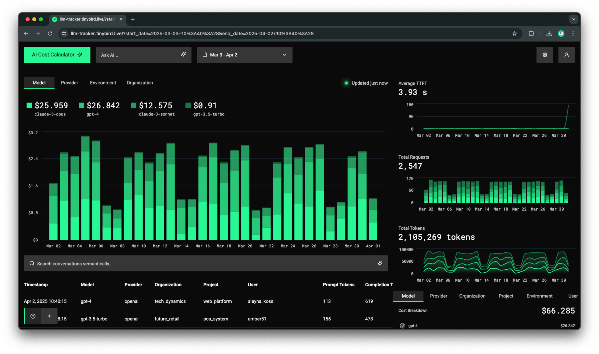

# LLM Performance Tracker

This is a template for an LLM performance tracker dashboard and cost calculator. It is built with Next.js and [Tinybird](https://tinybird.co).



Use this template to bootstrap a multi-tenant, user-facing LLM analytics dashboard and cost calculator.

Features:

- Track LLM costs, requests, tokens and duration by model, provider, organization, project, environment and user
- Multi-tenant user-facing dashboard
- AI cost calculator
- Vector search
- Ask AI integration

Fork it and make it your own! You can track your own metrics and dimensions.

Stack:

- [Next.js](https://nextjs.org/) - Application
- [Tinybird](https://tinybird.co) - Analytics
- [OpenAI](https://openai.com/) - AI features
- [Vercel AI SDK](https://sdk.vercel.ai/docs/introduction) - AI features
- [Vercel](https://sdk.vercel.ai/docs/introduction) - Application deployment
- [Clerk](https://clerk.com/) - User management and auth
- [Tremor](https://tremor.so/) - Charts

## Live Demo

- https://llm-tracker.tinybird.live

## Quick Start

Get started by forking the GitHub repository and then customizing it to your needs.

Start Tinybird locally:

```
curl https://tinybird.co | sh
cd tinybird
tb local start
tb login
tb dev
token ls  # copy the read_pipes token
```

Configure the Next.js application:

```
cd dashboard/ai-analytics
cp .env.example .env
Edit the .env file with your Tinybird API key and other configuration.
```

```
NEXT_PUBLIC_TINYBIRD_API_URL=http://localhost:7181
# read_pipes token
NEXT_PUBLIC_TINYBIRD_API_KEY=
```

Start the Next.js application:

```
cd dashboard/ai-analytics
npm install
npm run dev
```

Open the application in your browser:

```
http://localhost:3000
```

## Instrumentation

Send your data to Tinybird. Some examples:

- [LiteLLM (Python)](https://www.tinybird.co/docs/get-data-in/guides/ingest-litellm)
- [Vercel AI SDK (TypeScript)](https://www.tinybird.co/docs/get-data-in/guides/ingest-vercel-ai-sdk)

## Deployment

- Fork and connect this repository to Vercel.
- Set the environment variables in Vercel.
- Configure the [CI/CD GitHub actions](https://github.com/tinybirdco/ai-analytics-template/tree/main/.github/workflows) to deploy to Tinybird.

## Multi-tenancy

Create a Clerk project and set up these environment variables in your Next.js application:

```
# workspace ID for multi-tenant JWT tokens
TINYBIRD_WORKSPACE_ID=
# workspace admin token for multi-tenant JWT tokens
TINYBIRD_JWT_SECRET=

# Clerk publishable key
NEXT_PUBLIC_CLERK_PUBLISHABLE_KEY=
# Clerk secret key
CLERK_SECRET_KEY=
# Clerk sign in URL
NEXT_PUBLIC_CLERK_SIGN_IN_URL=/sign-in
NEXT_PUBLIC_CLERK_SIGN_UP_URL=/sign-up
NEXT_PUBLIC_CLERK_AFTER_SIGN_IN_URL=/
NEXT_PUBLIC_CLERK_AFTER_SIGN_UP_URL=/
```

The [middleware](https://github.com/tinybirdco/ai-analytics-template/blob/main/dashboard/ai-analytics/src/middleware.ts) will get the `org:name` permission from the Clerk user and use it to create a Tinybird JWT token with the `organization` dimension fixed to that value. Read more about Tinybird JWT tokens [here](https://www.tinybird.co/docs/forward/get-started/authentication#json-web-tokens-jwts).

## Mock Data

For local testing, generate mock data with the following commands:

```sh
cd tinybird/mock
npm install
npm run generate -- --start-date 2025-02-01 --end-date 2025-03-31 --events-per-day 100 --output ../fixtures/llm_events.ndjson
```

The [generate-llm-events.js](https://github.com/tinybirdco/ai-analytics-template/blob/main/tinybird/mock/generate-llm-events.js) script generates the embeddings.

## AI features

To use the AI features, click on Settings in the dashboard and input an OpenAI API key.

See the `search` and `extract-cost-parameters` [API routes](https://github.com/tinybirdco/ai-analytics-template/tree/main/dashboard/ai-analytics/src/app/api) for more details on how the AI features work.

## Vector search

The vector search is powered by Tinybird, but embeddings need to be calculated in a separate process. See the [generate-embedding](https://github.com/tinybirdco/ai-analytics-template/blob/main/dashboard/ai-analytics/src/app/api/generate-embedding/route.ts) route for more details.

The process is:

- The user inputs a query and clicks the search button.
- The query is sent to the `generate-embedding` route to get the embedding.
- The embedding is sent to the Tinybird `llm_messages` as a query parameter.
- `llm_messages` use `cosineDistance` to find the most similar vectors.
- The frontend shows the table rows with the most similar vectors.

## Contributing

See [CONTRIBUTING.md](./CONTRIBUTING.md)

## Support

Join the [Tinybird Slack community](https://www.tinybird.co/community) to get help with your project.

## License

MIT License

©️ Copyright 2025 Tinybird